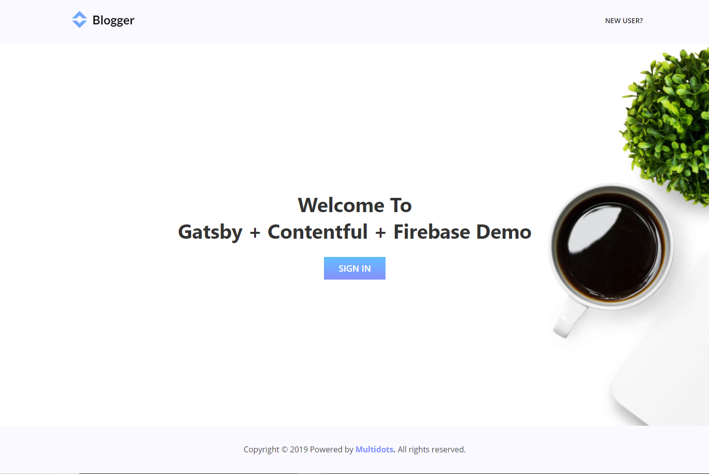

<p align="center">
  <a href="https://www.gatsbyjs.org">
    
  </a>
</p>
<h1 align="center">
  Gatsby + ContentFul + Firebase
</h1>

**Note:** This demo is built with [Gatsby](https://www.gatsbyjs.org/), and [Netlify CMS](https://www.netlifycms.org) <br />
**Demo URL:** [https://gatsby-blogger.netlify.com/](https://gatsby-blogger.netlify.com/)

 <br />

 <br />

  <br />

## Features

- Uses:
  - Gatsby.js (react + redux)
  - Firebase
  - ContentFul
  - Formspree
  - Disqus

- Features:
  - Sign in
  - Sign up
  - Forget Password
  - Sign out
  - Protected routes with authorization
  - Contact form submitted to **Formspree**
  - Disqus Comments

## Prerequisite

- Node
- Gatsby CLI (globally installed)

## Quick Start

Create your own project with the below Gatsby CLI (assuming Gatsby is installed) & install all the dependencies.


```sh
gatsby new your-project-name https://github.com/aslammultidots/blogger
cd your-project-name
npm install
```

## Requirements 

To run successfully use your own credentials for:
  - **Firebase**
  - **Disqus**
  - **Formspree**
  - **ContentFul**


#### Open the code and start editing files!

You can run your site at `http://localhost:8000`

Note: For making GraphQL work, run this link: `http://localhost:8000/___graphql`. Learn more about this tool in [Gatsby tutorial](https://www.gatsbyjs.org/tutorial/part-five/#introducing-graphiql).


#### Start Developing

For running your website locally, you have to run:

```sh
gatsby develop
```


## 💫 Deploy with Netlify

And lastly, deploy your site to Netlify:

[](https://app.netlify.com/start/deploy?repository=https://github.com/aslammultidots/blogger)